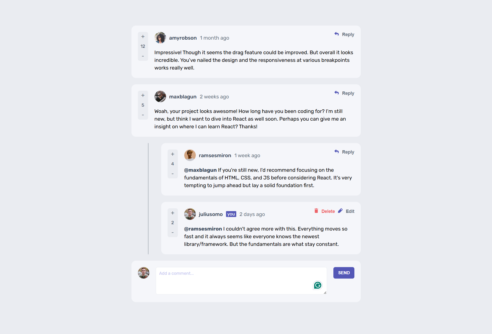
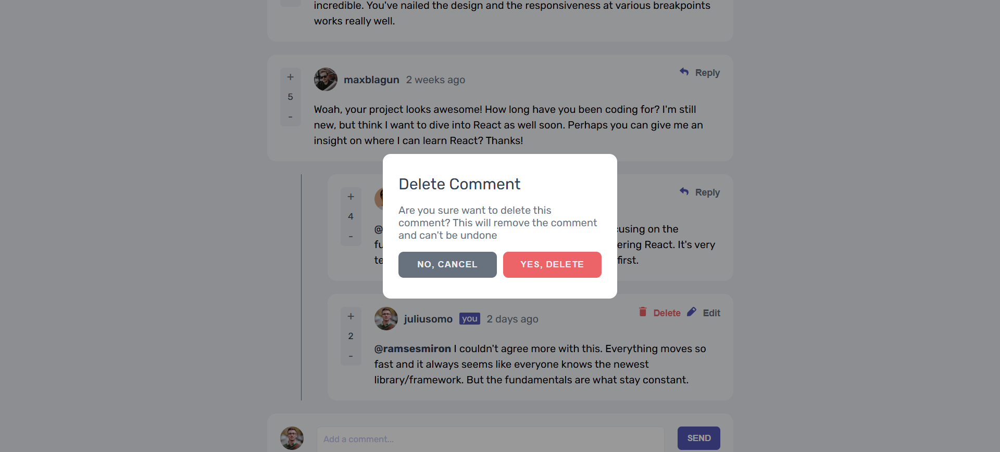
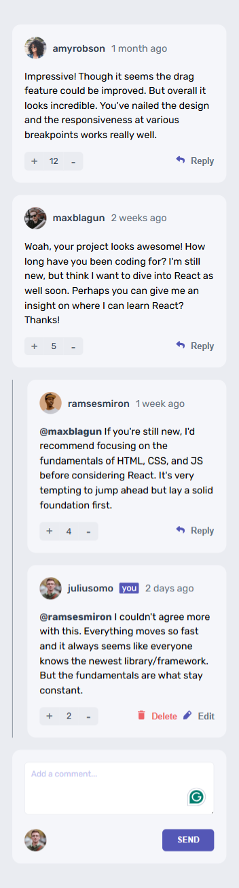

# Frontend Mentor - Interactive Comment Section Solution

This is a solution to the [E-commerce product page challenge on Frontend Mentor](https://www.frontendmentor.io/challenges/ecommerce-product-page-UPsZ9MJp6). Frontend Mentor challenges help you improve your coding skills by building realistic projects.

## Table of contents

- [Overview](#overview)
  - [The challenge](#the-challenge)
  - [Screenshot](#screenshot)
  <!-- - [Links](#links) -->
  - [Built with](#built-with)
  - [What I learned](#what-i-learned)
  - [Continued development](#continued-development)
- [Author](#author)

## Overview

This is a responsive and interactive comment section built with React, designed to replicate a modern comment thread experience. It supports nested replies, editing, voting, and deletion with confirmation—all in a clean and intuitive UI.

This project is a great example of handling component state, conditional rendering, and basic CRUD operations in React, with an emphasis on user interaction and UI/UX best practices.

### The challenge

Users should be able to:

- Add new Comment
- Modify his existing Comment.
- Delete his comment or reply.

### Screenshot

<!-- ### Links

- Solution URL: [Add solution URL here](https://your-solution-url.com)
- Live Site URL: [Add live site URL here](https://your-live-site-url.com) -->

### Built with

- Javasript React library
- useState Hooks from React
- CSS custom properties
- Flexbox
- CSS Grid
- Desktop-first workflow
- [React](https://reactjs.org/) - JS library

### What I learned

While I was already familiar with most of the React concepts used in this project, building this comment section helped reinforce component design and state management in a real-world interactive UI.

- Reusing the same component recursively to display comments and replies in a hierarchical structure. It was a challenge to ensure that after submitting a reply, it would correctly appear nested under the target comment without breaking the layout or state flow.
- Implementing the delete confirmation popup and managing state cleanup after confirmation. Handling the deletion logic while maintaining immutability and updating the UI accurately required careful state updates and component coordination.

This project gave me deeper insight into working with recursive component structures and conditional UI rendering with modals in React.

### Continued development

In future iterations, I plan to enhance this comment section into a fully functional thread-based discussion system, similar to platforms like Reddit. This will involve:

- **Nested Threading**: Allowing replies to have their own replies, creating a deeper multi-level comment hierarchy
- **Dynamic Thread Depth Rendering**: Optimizing the UI to handle deep nesting gracefully without breaking readability or layout.
- **Persistence with Backend**: Integrating a backend or database (e.g., Firebase, Node.js + MongoDB) to store and manage comments across sessions.
- **Sorting & Filtering**: Adding features like sort by Top, Newest, or Controversial, to organize threads more meaningfully.

## Author

- Name - **Sandeep Murmu**
- Frontend Mentor - [@Sandeep-Murmu](https://www.frontendmentor.io/profile/Sandeep-Murmu)
- Github - [Sandeep-Murmu](https://github.com/Sandeep-Murmu)
